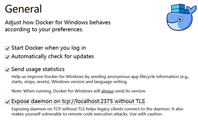

# Docker Tutorial
## 参考书籍
1. [Docker — 从入门到实践](https://github.com/yeasy/docker_practice)
   > 在国内，安装docker必须配置**镜像加速器**，阿里云提供镜像加速服务
   >> 可以建立**私有镜像仓库** `docker run -d -p 5000:5000 --restart always --name registry registry:2`，另外nexus新版本也提供镜像仓库功能
   >>> [访问本地私有仓库需要设置Insecure registries，因为默认为https，而这些私有仓库都只提供http](_images/docker-config.png)
## 注意事项
* 以compose方式运行的时候，需要关闭TLS，之后还要登录windows
  

