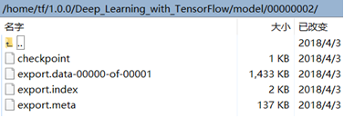

## Tensorflow Mnist手写数字识别Go实战
* [链接](http://sineyuan.github.io/2017/03/02/tensorflow-mnist-pratice/)
* [github](https://github.com/SineYuan/tensorflow-demo)
### 注意事项
* 需要注意的是训练并导出模型需要使用1.0.0版本，不然有兼容性问题

### debug
* 修改输入tensor签名名称
  ```
  rpc error: code = InvalidArgument desc = input tensor alias not found in signature: x1
  ```
* 修改输出tensor签名名称
  ```
  can not find output data with label y
  ```
* 修改输入tensor签名数据长度
  ```
  rpc error: code = Internal desc = Invalid header field value "input to reshape is a tensor with 1260 values, but the requested shape requires a multiple of 588\n\t [[Node: Reshape=Reshape[T=DT_FLOAT,Tshape=DT_INT32,_device=\"/job:localhost/replica:0/task:0/cpu:0\"](Relu_2, Reshape/shape)]]
  ```
### 关键代码
* mnist_cnn.py
    ```
    # input X: 28x28 grayscale images, the first dimension (None) will index the images in the mini-batch
    X = tf.placeholder(tf.float32, [None, 28, 28, 1])
    # correct answers will go here
    Y_ = tf.placeholder(tf.float32, [None, 10])

    # Export model to Tensorflow Serving
    saver = tf.train.Saver()

    model_exporter = exporter.Exporter(saver)
    model_exporter.init(
        sess.graph.as_graph_def(),
        named_graph_signatures={
            'inputs': exporter.generic_signature({'x': X}),
            'outputs': exporter.generic_signature({'y': Y})
        }
    )
    model_exporter.export(flags.model_dir, tf.constant(flags.model_version), sess)
    ```
    >签名
    >>test
    
    >模型保存
    >>saver = tf.train.Saver()  
    >>
* main.go
  ```
  tp := &tf_framework.TensorProto{
  Dtype:    tf_framework.DataType_DT_FLOAT,
  FloatVal: in,
  TensorShape: &tf_framework.TensorShapeProto{
      Dim: []*tf_framework.TensorShapeProto_Dim{
             &tf_framework.TensorShapeProto_Dim{
              Size: int64(1),
              Name: "batch",
             },
             &tf_framework.TensorShapeProto_Dim{
              Size: int64(28),
              Name: "x",
             },
             &tf_framework.TensorShapeProto_Dim{
              Size: int64(28),
              Name: "y",
             },
             &tf_framework.TensorShapeProto_Dim{
              Size: int64(1),
              Name: "channel",
             },
      },
    },
  }
  req.Inputs["x"] = tp
  resp, err := c.Predict(context.Background(), req)
  if err != nil {
  	return
  }
  output, ok := resp.Outputs["y"]
  ```