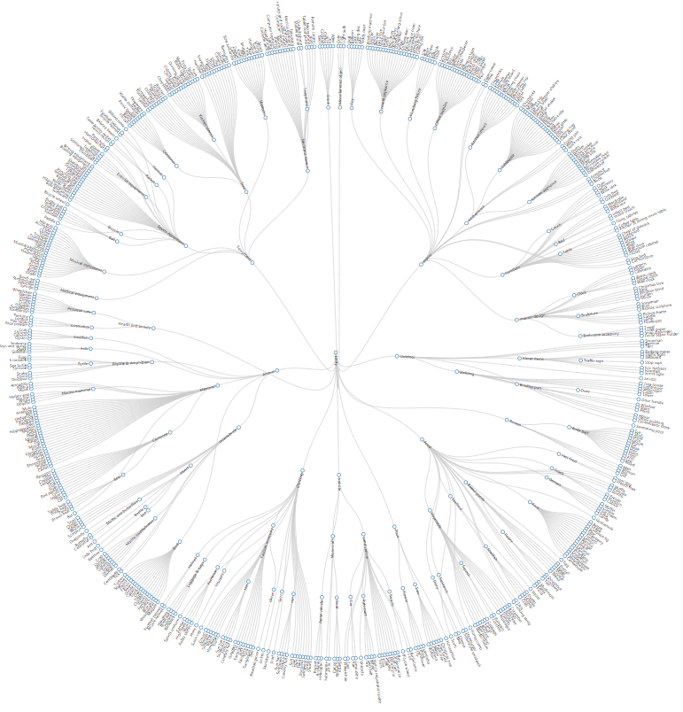

# 数据格式

## 链接
* [Open Images Dataset V4](https://storage.googleapis.com/openimages/web/download.html#attributes)
  >[image label](https://storage.googleapis.com/openimages/2017_07/bbox_labels_vis/bbox_labels_vis.html)  
  
## paper
* [We don't need no bounding-boxes: Training object class detectors using only human verification](https://arxiv.org/abs/1602.08405)
* [Extreme clicking for efficient object annotation](https://arxiv.org/abs/1708.02750)