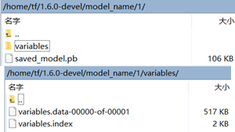

## 构建并用 TensorFlow Serving 部署 Wide & Deep 模型
* [链接](https://www.jianshu.com/p/2fffd0e332bc)
* [github](https://github.com/edvardHua/Articles)

### 注意事项
* [sineyuan/tensorflow_model_server](https://hub.docker.com/r/sineyuan/tensorflow_model_server/)
  >tensorflow model server built from [https://github.com/tensorflow/serving](https://github.com/tensorflow/serving)
* [bitnami/tensorflow-serving](https://hub.docker.com/r/bitnami/tensorflow-serving/)
  >Bitnami Docker Image for TensorFlow Serving
  [https://github.com/bitnami/bitnami-docker-tensorflow-serving](https://github.com/bitnami/bitnami-docker-tensorflow-serving)

### debug
* 向签名完全不对的server发起请求
  ```
  rpc error: code = NotFound desc = Servable not found for request:Latest(default)
  ```
* 关闭server，发起请求，过大约30秒，返回错误码
  ```
  rpc error: code = Unavailable desc = all SubConns are in TransientFailure
  ```
### 关键代码
* WDLRegression.py
  ```
  # 将训练好的模型保存在当前的文件夹下
  builder = tf.saved_model.builder.SavedModelBuilder(join("./model_name", MODEL_VERSION))
  inputs = {
      "x_wide": tf.saved_model.utils.build_tensor_info(x_wide),
      "x_deep": tf.saved_model.utils.build_tensor_info(x_deep)
  }
  output = {"output": tf.saved_model.utils.build_tensor_info(prediction)}
  prediction_signature = tf.saved_model.signature_def_utils.build_signature_def(
      inputs=inputs,
      outputs=output,
      method_name=tf.saved_model.signature_constants.PREDICT_METHOD_NAME
  )

  builder.add_meta_graph_and_variables(
      sess,
      [tf.saved_model.tag_constants.SERVING],
      {tf.saved_model.signature_constants.DEFAULT_SERVING_SIGNATURE_DEF_KEY: prediction_signature}
  )
  builder.save()
  ```
  >单个签名
  >>prediction_signature = tf.saved_model.signature_def_utils.build_signature_def

  >模型保存
  >>builder = tf.saved_model.builder.SavedModelBuilder(join("./model_name", MODEL_VERSION))  
  >>