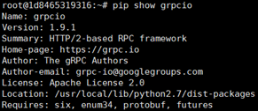
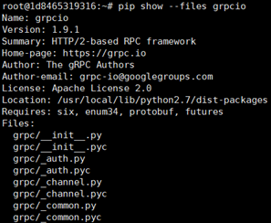

# ProtoBuf & gPRC
* ProtoBuf 是一套接口描述语言（IDL）和相关工具集（主要是 protoc，基于 C++ 实现），类似 Apache 的 Thrift）。用户写好 .proto 描述文件，之后使用 protoc 可以很容易编译成众多计算机语言（C++、Java、Python、C#、Golang 等）的接口代码。这些代码可以支持 gRPC，也可以不支持。

* gRPC 是 Google 开源的 RPC 框架和库，已支持主流计算机语言。底层通信采用 gRPC 协议，比较适合互联网场景。gRPC 在设计上考虑了跟 ProtoBuf 的配合使用。

* 两者分别解决的不同问题，可以配合使用，也可以分开。
* 典型使用场景是，写好.proto描述文件定义RPC的接口，然后用protoc（带gRPC插件）基于.proto模板自动生成客户端和服务器端的接口代码。

## 参考
* [ProtoBuf 与 gRPC 你需要知道的知识](https://blog.csdn.net/yeasy/article/details/52190007)
* [galang 学习之grpc+ protobuf](https://blog.csdn.net/u010278923/article/details/70130024)
* [grpc-go example](https://github.com/grpc/grpc-go/tree/master/examples)
* [Python RPC 之 gRPC](https://blog.csdn.net/coderinfo/article/details/60883030)

## 代码
* protoc的命令格式为 protoc [OPTION] PROTO_FILES
  
### java
  ```
  protoc --java_out=./java/ ./proto/helloworld.proto
  ```
  >--java_out为输出java代码目录  

  >随后我们指定了proto文件的位置 ./proto/helloworld.proto

### go
* 没有官方支持，需要安装protoc对应的plugin
  >`go get -u github.com/golang/protobuf/{protoc-gen-go,proto}`
  >>前者是plugin，后者是go的依赖库

* 下面几种方式都可以生成
  ```
  protoc --go_out = ./go/ ./proto/helloword.proto
  ```
  >和上面java生成方式一样
  ```
  protoc --go_out=./go/ -I proto ./proto/helloworld.proto
  ```
  >简单来说，就是如果多个proto文件之间有相互依赖，生成某个proto文件时，需要import其他几个proto文件，这时候就要用-I来指定搜索目录。如果没有指定-I参数，则在当前目录进行搜索。

### python
* `pip show grpcio`
  >
* `pip show --files grpcio`
  >
* tensorflow-serving包
  ```
  from os.path import join

  from pprint import pprint
  from grpc.beta import implementations
  from tensorflow-serving.apis import predict_pb2
  from tensorflow-serving.apis import prediction_service_pb2
  ```
  >

### gRPC
    ```
    protoc --go_out=plugin=grpc:. hello.proto
    ```