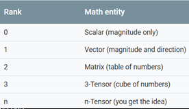
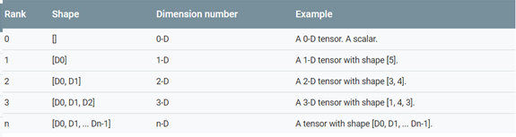

# tensorflow
## tensorflow语法
### 张量/变量
* 张量的第一个属性名字不仅是一个张量的唯一标识符，它同样也给出了张量是如何计算出来的。
* 张量和计算图上所代表的计算结果是对应的
张量的命名“node: src_output”
* 在TensorFlow中，变量的声明函数tf.Variable是一个运算，这个运算的结果就是一个张量，这个张量就是变量，所以变量只是一种特殊的张量
* [TensorFlow Variables and Constants](https://stackoverflow.com/questions/44745855/tensorflow-variables-and-constants?utm_medium=organic&utm_source=google_rich_qa&utm_campaign=google_rich_qa)
* [What's the difference between tf.placeholder and tf.Variable](https://stackoverflow.com/questions/36693740/whats-the-difference-between-tf-placeholder-and-tf-variable?utm_medium=organic&utm_source=google_rich_qa&utm_campaign=google_rich_qa)
* `a = tf.constant(5.0, name='a')`
  >a is not the constant op, but its output. 
  >Names of op outputs derive from the op name by adding a number corresponding to its rank.
  >Here, constant has only one output, so its name is
    ```
    print(a.name)
    # 'a:0'
    ```
  `sess.graph.get_operation_by_name('a')`
  >we get the constant op.
  >But what you actually wanted is to get `a:0` ,the tensor that is the output of this operation, and whose evaluation returns an array.
  ```
  a = sess.graph.get_tensor_by_name('a:0')
  print(sess.run(a))
  # 5
  ```
* [How does TensorFlow name tensors?](https://stackoverflow.com/questions/36150834/how-does-tensorflow-name-tensors)
* some types of tensors are special, and these will be covered in other units of the Programmer's guide. The main ones are:
  1. tf.Variable
  2. tf.constant
  3. tf.placeholder
  4. tf.SparseTensor  
* With the exception of `tf.Variable`, the value of a tensor is immutable, which means that in the context of a single execution tensors only have a single value. However, evaluating the same tensor twice can return different values; for example that tensor can be the result of reading data from disk, or generating a random number. 
* `tf.Variable()`才有`assign()`方法，因为它是mutable tensor
  ```
  v = tf.Variable(3, name='v')
  v2 = v.assign(5)
  ```

### operation
* [初步理解 TensorFlow 的 operation](https://zhuanlan.zhihu.com/p/3239903)
   1. 所有的常量、变量和计算的操作都是 OP  
   2. 变量包含的 OP 更加复杂
   3. 可以通过 graph.get_operation_by_name，或者 x.op 的方式获得该 OP 的详细信息
   4. OP 可以简单理解为一个个小份的特定任务，通过并发地执行Kernel实现

### Rank
  1. For rank 0 tensor(a scalar), no indices are neccessary, since it is already a single number: `my_scalar`  
  2. For rank 1 tensor(a vector), passing a single index allows you to access a number: `my_scalar = my_vector[2]`  
  3. For tensors of rank 2 or higher, the situation is more interesting. For a tf.Tensor of rank 2, passing two numbers returns a scalar, as expected: `my_scalar = my_matrix[1, 2]`  
  Passing a single number, however, returns a subvector of a matrix, as follows: `my_row_vector = my_matrix[2]` `my_column_vector = my_matrix[:, 3]`  
  The : notation is python slicing syntax for "leave this dimension alone". This is useful in higher-rank Tensors, as it allows you to access its subvectors, submatrices, and even other subtensors.  
    
### Shape
  * The shape of a tensor is the number of elements in each dimension. TensorFlow automatically infers shapes during graph construction. These inferred shapes might have known or unknown rank. If the rank is know, the sizes of each dimension might be known or unknown.  

  * The TensorFlow documentation uses three notational conventions to describe tensor dimensionality: `rank, shape, dimension number`. The following table shows these relate to one another:  
    

  * `tf.shape(x)`  
    `shape=tf.placeholder(tf.float32, shape=[None, 227, 227, 3])`
    这样feed数据，如果想在运行的时候想知道 `None` 到底是多少，这时候，只能通过 `tf.shape(x)[0]` 这种方式来获得。
  * `tensor.get_shape()`
  * `zeros = tf.zeros(my_matrix.shape[1])`
    >make a vector of zeros with the same size as the number of columns in a given matrix
  * The number of elements of a tensor is the product of the sizes of all its shapes. The number of elements of a scalar is always 1. Since there are often many different shapes that have the same number of elements, it's often convinient to be able to change the shape of a `tf.Tensor`, keeping its elments fixed. This can be done with `tf.reshape`.
    ```
    rank_three_tensor = tf.ones([3, 4, 5])
    matirx = tf.reshape(rank_three_tensor, [6, 10])
    matrixB = tf.reshape(matrix, [3, -1])
    matrixAlt =  tf.reshape(matrixB, [4, 3, -1])
    ```
## 常用命令
* `tf.summary.FileWriter()`
  >  
  ```
  writer = tf.summary.FileWriter("log", tf.get_default_graph())
  writer.close()
  ```
  ```
  graph_export = tf.Graph()

  with graph_export.as_default():
    tf.import_graph_def(output_graph_def, name="")
  writer = tf.summary.FileWriter("/root.log.constant_save.log", graph_export)
  writer.close()
  ```
## 模型
* [TensorFlow 版本 inception v3 网络代码解读](https://zhuanlan.zhihu.com/p/34055904)