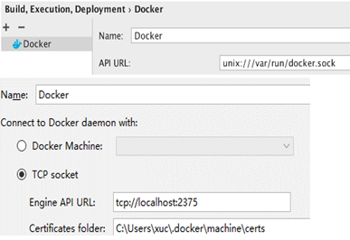
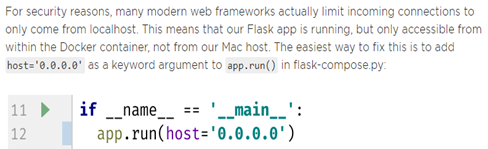
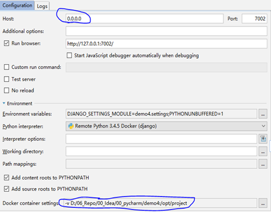

# python
## pycharm
* [Docker-Compose: Getting Flask up and running](https://blog.jetbrains.com/pycharm/2017/03/docker-compose-getting-flask-up-and-running/)
* [Using Docker in PyCharm](https://blog.jetbrains.com/pycharm/2015/12/using-docker-in-pycharm)
* 新版本的Pycharm可以使用更好用的Docker Compose方式来运行，要指定两个编排文件，一个用于部署，一个用于debug，debug模式需要指定：
  ```
  if __name__ == '__main__':
    app.debug = True
    app.run(host='0.0.0.0')
  ```
* Pycharm使用docker时，需要配置docker API，windows中配置为主机加端口号，unix配置为 `docker.sock` 文件。
  
* 运行flask程序时，要指定host为0.0.0.0主机才能访问到docker中的内容.  
  
* 运行Django程序的时候，host要指定为0.0.0.0才能访问docker中的内容，端口会自动映射，映射规则就是7002:7002，同端口映射.  
  

## matplotlib
* [colormaps_reference](https://matplotlib.org/examples/color/colormaps_reference.html)

## reference

* [Python使用struct处理二进制](https://www.cnblogs.com/gala/archive/2011/09/22/2184801.html)
* [python 按二维数组的某行或列排序 (numpy lexsort)](https://www.cnblogs.com/liyuxia713/p/7082091.html)
* [Python中numpy的where()函数](http://www.cnblogs.com/oxxxo/p/6129294.html)
* [Numpy where function multiple conditions](https://stackoverflow.com/questions/16343752/numpy-where-function-multiple-conditions)
* [Box plot with min, max, average and standard deviation](https://stackoverflow.com/questions/33328774/box-plot-with-min-max-average-and-standard-deviation)
* [Python format 格式化函数](http://www.runoob.com/python/att-string-format.html)
