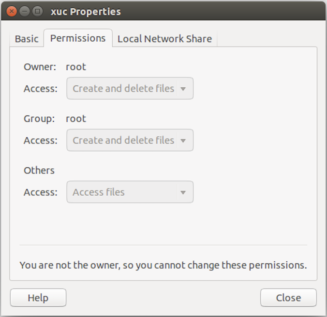

## 虚拟机环境搭建

* [VirtualBox如何扩展虚拟机Ubuntu的硬盘容量？](https://blog.csdn.net/ouyang_peng/article/details/53261599)
  >从第三部 ： 分区开始
* [virtul box 挂载文件夹](https://blog.csdn.net/a962804835/article/details/72820355)

### 使用virtual box建立环境

* 支持scp，ssh server
  >`apt-get install openssh-server`

* 增加硬盘空间

```bash
#查看当前虚拟机硬盘，需要vm加载当前虚拟机，得到硬盘ID
VBoxManage list hdds
#修改硬盘大小
VBoxManage modifyhd 77a925b1-5bc5-4987-9bab-2b70e07823b2 --resize 102400
#启动虚拟机，查看空间，此时没有分区，看不到
df -H
#查看当前分区，记住sector号，新分区要大于老分区最大的sector号
sudo fdisk -l /dev/sda
#分区，选择为p，注意sector号，w写入，重启虚拟机，reload分区表
sudo fdisk /dev/sda
#查看当前各分区格式化格式
df -T
#格式化新分区，重启
sudo mkfs -t ext4 /dev/sda3
#新建挂载目录
mkdir xuc
#把新建目录挂载到新分区
sudo mount /dev/sda3 /home/roaddb/xuc
#修改目录权限，把当前用户加入，否则只有root权限可以操作，这里粗糙的直接777
sudo chmod -R  777 ./xuc/
#为了避免每次重启需要重新挂载，做如下修改
sudo vim /etc/fstab
  /dev/sda3 /home/roaddb/xuc/ ext4 defaults 0 1
```

* 
  >要设置大一点
* 
  >如果设置小了，虚拟机屏幕分辨率不够
* 
  >```bash
  >在宿主机上创建文件夹
  >sudo mkdir /home/usr/repo/
  >
  >#改变宿主机权限
  >sudo chmod -R 777 /home/usr/repo/
  >
  >#虚拟机创建目录
  >sudo mkdir /mnt/xuc
  >
  >#改变目录权限
  >sudo chmod -R 777 /mnt/xuc
  >
  >#挂载宿主机目录到虚拟机目录
  >sudo mount -t vboxsf repo /mnt/xuc
  >
  >在虚拟机查看文件夹权限，然后
   
  >将用户加入Group所在的组（这里为root）
  >sudo usermod -aG root $(whoami)
  >#取消挂载
  >sudo umount /mnt/xuc
  >
  >#删除目录
  >sudo rm -rf /mnt/xuc
  >```bash

* 
  >网卡要先删除，在增加，否则不能上网，因为mac地址会与别人一样
* 