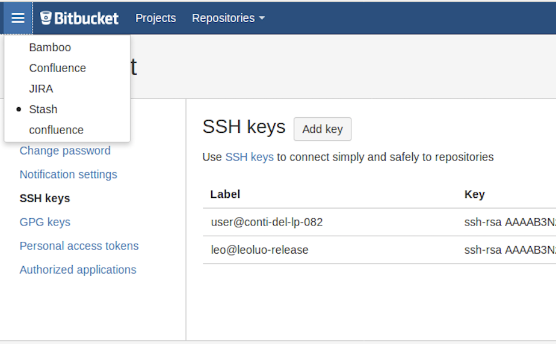

## 参考
* [slum book](https://github.com/gaoxiang12/slambook)
* [virtul box 挂载文件夹](https://blog.csdn.net/a962804835/article/details/72820355)
* [CMake如何查找链接库---find_package的使用方法](https://blog.csdn.net/u011092188/article/details/61425924)
* [CMake实践》笔记二：INSTALL/CMAKE_INSTALL_PREFIX](https://blog.csdn.net/primeprime/article/details/53020147)
* [自己创建XXConfig.cmake文件](https://blog.csdn.net/historycomputer/article/details/59121420)
* [hpp](https://blog.csdn.net/davidhsing/article/details/4222227)
* [ninja](https://www.jianshu.com/p/d118615c1943)
* [欧拉角](https://blog.csdn.net/csxiaoshui/article/details/65437633)
* [eigen](http://eigen.tuxfamily.org/index.php?title-Main_Page)
  >矩阵库
* [pangolin](https://github.com/stevenlovegrove/Pangolin)
  >OpenGL封装库
* [pangolin安装及其使用](https://blog.csdn.net/c602273091/article/details/65441315)
* [C++里面ostream是干什么的](https://zhidao.baidu.com/question/584182022.html?qbl=relate_question_3&word=ostream%26%20operator)
* [Sophus](https://github.com/strasdat/Sophus)
  >李群库
  >```
  > cmake .. -DCMAKE_INSTALL_PREFIX:PATH=$HOME/svslocal
  > sudo make -j4
  > sudo make install
  >```
* [PCL](http://pointclouds.org)
  >Point Cloud Library
  >提供点云转换为地图的功能
* [Ceres](https://github.com/ceres-solver/ceres-solver)
  >通用最小二乘问题求解库
* [g2o](https://github.com/RainerKuemmerle/g2o)
  >通用图优化库
* [opencv](https://opencv.org)
  >[github](https://github.com/opencv/opencv/tree/3.0.0)
  >> 3.1.0 安装报错
* [valgrind](http://www.valgrind.org/)
  >`sudo apt-get install valgrind`  
  >[Linux下性能分析工具和内存泄露检测工具的简介](https://blog.csdn.net/u014717036/article/details/50762252)
  >`valgrind --log-file=./valgrind_report_all --tool=memcheck --leak-check=full --show-leak-kinds=all ./pose_estimation_3d2d 1.png 2.png 1_depth.png 2_depth.png`
* [C++模板](https://www.cnblogs.com/yutongqing/p/6721323.html)
* [C++ Template 基础篇（一）：函数模板](https://blog.csdn.net/lezardfu/article/details/56852043)
* [卡尔曼滤波和维纳滤波](https://blog.csdn.net/sillykog/article/details/78535767)
* [李群、李代数在计算机视觉中的应用](https://blog.csdn.net/x_r_su/article/details/52749616)
* [C++智能指针简单剖析](http://www.cnblogs.com/lanxuezaipiao/p/4132096.html)
* [C++类构造函数初始化列表](http://www.cnblogs.com/BlueTzar/articles/1223169.html)
* [C++笔记——std::min_element和std::max_element](https://blog.csdn.net/breeze5428/article/details/25918925)
* [非修改性序列算法之min_element和max_element](https://blog.csdn.net/maoliran/article/details/52205549)
* [C++11中的匿名函数(lambda函数,lambda表达式)](https://www.cnblogs.com/pzhfei/archive/2013/01/14/lambda_expression.html)
* [C++拷贝构造函数(深拷贝，浅拷贝)](http://www.cnblogs.com/BlueTzar/articles/1223313.html)
* [C++移动构造函数以及move语句简单介绍](https://www.cnblogs.com/qingergege/p/7607089.html)
* [C++类的特殊成员-默认/拷贝/移动构造函数](https://blog.csdn.net/shenwanjiang111/article/details/53576196)
* [C++析构函数后加上virtual的原因](https://blog.csdn.net/u014453898/article/details/60402586)
* [C++强制类型转换操作符 static_cast](http://www.cnblogs.com/QG-whz/p/4509710.html)
* [C++中结构体与类的区别（struct与class的区别](https://www.cnblogs.com/starfire86/p/5367740.html)
* [c++中c_str()用法，越详细越好](https://zhidao.baidu.com/question/104592558.html)
* [C++using声明和using指示](https://blog.csdn.net/mlyjqx/article/details/74783811)
* [C++11中继承构造函数和委派构造函数](https://blog.csdn.net/yp18792574062/article/details/74853524)
* [C++11特性：decltype关键字](https://www.cnblogs.com/QG-whz/p/4952980.html)
* [C++11关于constexpr与const](https://blog.csdn.net/qq_22274565/article/details/78719951)
* [C++11 initializer_list详解](https://blog.csdn.net/fengxinlinux/article/details/72614874)
* [C++: explicit的适用场合以及为什么要使用explicit](https://blog.csdn.net/qq_37233607/article/details/79051075)
* [C++中的RAII机制](https://blog.csdn.net/wozhengtao/article/details/52187484)
* [JAVA异常处理 与C++的不同](https://blog.csdn.net/ljlove2008/article/details/3076337)
* [Does C++ support 'finally' blocks? (And what's this 'RAII' I keep hearing about?)](https://stackoverflow.com/questions/161177/does-c-support-finally-blocks-and-whats-this-raii-i-keep-hearing-about)
* [C++ What is stack unwinding?](https://stackoverflow.com/questions/2331316/what-is-stack-unwinding)
* [C++深入理解linux下进程和线程的空间分配，进程栈和线程栈的空间分配](https://blog.csdn.net/elfprincexu/article/details/78779158)
* [Linux虚拟地址空间布局以及进程栈和线程栈总结](https://www.cnblogs.com/xzzzh/p/6596982.html)
* [C++gdbServer + gdb 调试](https://www.cnblogs.com/Dennis-mi/articles/5018745.html)
* [Linux write的奥秘](https://blog.csdn.net/tangtang_yue/article/details/73188526)
* [C++ 什么是thread_local](https://en.cppreference.com/w/c/language/storage_duration)
* [C++之多线程实现(C++11)](https://blog.csdn.net/hai008007/article/details/80246437)
* [用C++11的std::async代替线程的创建](https://www.cnblogs.com/qicosmos/p/3534211.html)
* [C++的函数对象优于函数指针地方](https://www.cnblogs.com/lvonve/p/8832426.html)
* [c++11多线程编程（九）：std::async介绍与实例](https://blog.csdn.net/lijinqi1987/article/details/78909479)
* [C++11 thread_local 关键词](https://blog.csdn.net/u013390476/article/details/52129607)
* [C++ Using __thread in c++0x](https://stackoverflow.com/questions/7047226/using-thread-in-c0x)
* [线程绑定CPU核-sched_setaffinity](https://blog.csdn.net/lanyzh0909/article/details/50404664)
* [Linux进程或线程绑定到CPU](https://www.cnblogs.com/swey/p/4469722.html)
* [taskset: 让进程运行在指定的CPU](https://www.cnblogs.com/edwardlost/archive/2010/10/23/1858991.html)
* [Linux 下taskset命令](http://blog.51cto.com/wujianwei/2051589)
* [CPU frequency scaling](https://wiki.archlinux.org/index.php/CPU_frequency_scaling_(%E7%AE%80%E4%BD%93%E4%B8%AD%E6%96%87))
* [使用cpufreq给CPU临时调整主频](https://www.kwx.gd/CentOSApp/CentOS-Cpufreq-Set.html)
* [信号](http://akaedu.github.io/book/ch33.html)
* [使用 Valgrind 检测 C++ 内存泄漏](http://senlinzhan.github.io/2017/12/31/valgrind/)
  > C++ 在分配内存时，为了提高效率，使用了它自己的内存池。当程序终止时，内存池的内存才会被操作系统回收，所以 Valgrind 会将这部分内存报告为 reachable 的，需要注意，reachable 的内存不代表内存泄漏
* [how does linux execute my main()](http://www.tldp.org/LDP/LG/issue84/hawk.html)
  >__libc_start_main
* [Trampoline](https://en.wikipedia.org/wiki/Trampoline_(computing))
* [Thunk](https://en.wikipedia.org/wiki/Thunk)
* [What is a trampoline function?](https://stackoverflow.com/questions/189725/what-is-a-trampoline-function)
* [Linux中fork，vfork和clone详解（区别与联系）](https://blog.csdn.net/gatieme/article/details/51417488)
* [pthread_mutex_unlock](https://linux.die.net/man/3/pthread_mutex_unlock)
* [Readers–writers problem](https://en.wikipedia.org/wiki/Readers%E2%80%93writers_problem)
* [Linux线程间同步 —— 读写锁（reader-writer lock）](https://blog.csdn.net/electrocrazy/article/details/79016629)
* [深入浅出 Barriers 实现（一）](http://www.cnblogs.com/haippy/archive/2012/12/26/2833554.html)
* [Linux pthread 障碍同步barrier](https://blog.csdn.net/aspirinvagrant/article/details/24085963)
* [Avoiding Deadlock](https://docs.oracle.com/cd/E19455-01/806-5257/6je9h0347/index.html)
* [pthread_join](https://baike.baidu.com/item/pthread_join/2296997?fr=aladdin)
* [The Happens-Before Relation](https://blog.csdn.net/sparkliang/article/details/52948039)
* [pthread_once()函数详解](https://www.cnblogs.com/lit10050528/p/4325888.html)
* [Linux共享内存对象，shm_open,mmap](https://blog.csdn.net/xwc583413343/article/details/55211071)
* [Linux进程同步机制-Futex](https://blog.csdn.net/nellson/article/details/5400360)
* [C++11多线程之mutex等锁机制和atomic原子操作对比](https://blog.csdn.net/hspingcc/article/details/54617531)
* [关于锁和同步（一）原子操作和非原子操作](https://blog.csdn.net/zhangqhn/article/details/80876177)
* [Memory model synchronization modes](https://gcc.gnu.org/wiki/Atomic/GCCMM/AtomicSync)
* [C++检测异常assert()函数](https://blog.csdn.net/fx677588/article/details/76408503)
* [gcc中-pthread和-lpthread的区别](http://chaoslawful.iteye.com/blog/568602)
* [gcc -pthread 与 -lpthread](https://blog.csdn.net/u012313689/article/details/53290758)
* [Linux 线程锁,条件变量 信号量的区别](https://blog.csdn.net/sunnyboy_cia/article/details/6278640)
  >锁必须是同一个线程获取以及释放, 否则会死锁.而条件变量和信号量则不必
* [Linux 线程锁 条件变量 信号量的区别2](https://blog.csdn.net/sunnyboy_cia/article/details/6278673)
  >信号量用在多线程多任务同步的
  >而互斥锁是用在多线程多任务互斥的
  >在对称多处理器(Symmetric Multi-Processor)结构中就不同了，由于系统中有多个处理器在独立地运行，即使能在单条指令中完成的操作也有可能受到干扰
* [Linux 线程锁 条件变量 信号量的区别3](https://blog.csdn.net/sunnyboy_cia/article/details/6278684)
* [How do you handle pthread_mutex_unlock failures?](https://stackoverflow.com/questions/7422316/how-do-you-handle-pthread-mutex-unlock-failures)
* [读写锁pthread_rwlock_t的使用](https://blog.csdn.net/hpu11/article/details/62077037)
* [CLOCK_MONOTONIC与CLOCK_REALTIME区别](https://blog.csdn.net/tangchenchan/article/details/47989473)
* [[Pthread] Linux中的内存管理(一)--Paging](https://blog.csdn.net/javadino/article/details/2891446)
* [深入理解可重入与线程安全](https://blog.csdn.net/tangaowen/article/details/47856705)
* [Making Legacy Code Safe in Multi-Threaded Environments](http://www.wesleysteiner.com/professional/MakingLegacyCodeSafe.html)
* [Threadsafe vs re-entrant](https://stackoverflow.com/questions/856823/threadsafe-vs-re-entrant)
  >Thread_local可以做到线程安全，但是不一定是可重入，因为同一线程递归调用的话，会产生栈以外的依赖
* [线程安全与可重入性](https://www.cnblogs.com/west000/p/6863580.html)
* [程序减肥，strip，eu-strip 及其符号表](https://blog.csdn.net/doniexun/article/details/45043297)
* [深入理解cache](http://www.360doc.com/content/14/1015/13/10249440_417146850.shtml)

* [通过 GCC 学习 OpenMP 框架](https://blog.csdn.net/xceman1997/article/details/10197567)
* [Mat 数据类型指针ptr 的使用](https://blog.csdn.net/qq_22637049/article/details/77688452)
* [图像处理中，outlier和inlier分别指什么](https://blog.csdn.net/daigualu/article/details/73866250)

## 命令
* 解析elf文件
  ```
  readelf -S ./octomap_mapping
  ```
* 删除elf文件符号表
  ```
  strip --strip-debug ./octomap_mapping
  strip --strip-all ./octomap_mapping
  eu-strip ./octomap_mapping -f ./octomap_mapping.sym
  ```
* 打印elf文件
  ```
  nm ./octomap_mapping
  ```
## 资源
* [vscode下载](https://code.visualstudio.com/Download)
* [meshlab](http://www.meshlab.net/)
  >ubuntu app store里有
* [DBow](https://github.com/rmsalinas/DBow3)
  >DBoW3 is an improved version of the DBow2 library, an open source C++ library for indexing and converting images into a bag-of-word representation
* [BitBucket](http://tech.it168.com/a2017/1026/3176/000003176180.shtml)
  >集成了jira工具
* [OctoMap](https://github.com/OctoMap/octomap)
  >An Efficient Probabilistic 3D Mapping Framework Based on Octrees
## Bitbucket/Stash
* 生成key
  ```
  ssh-keygen
  cat ~/.ssh/id_rsa.pub
  ```
* 

## 虚拟机环境搭建
使用virtual box建立环境
* 
  >要设置大一点
* 
  >如果设置小了，虚拟机屏幕分辨率不够
* 
  >```
  >在宿主机上创建文件夹
  >sudo mkdir /home/usr/repo/
  >
  >#改变宿主机权限
  >sudo chmod -R 777 /home/usr/repo/
  >
  >#虚拟机创建目录
  >sudo mkdir /mnt/xuc
  >
  >#改变目录权限
  >sudo chmod -R 777 /mnt/xuc
  >
  >#挂载宿主机目录到虚拟机目录
  >sudo mount -t vboxsf repo /mnt/xuc
  >
  >#取消挂载
  >sudo umount /mnt/xuc
  >
  >#删除目录
  >sudo rm -rf /mnt/xuc
  >```
* 
  >网卡要先删除，在增加，否则不能上网
* 
## 安装ceres
* 安装依赖包
  >```
  >sudo apt-get install libgflags-dev
  >sudo apt-get install libgoogle-glog-dev
  >```
* 安装本尊
  >```
  >sudo mkdir build
  >cd build
  >sudo cmake ../
  >sudo make
  >make install
  >``` 
## 安装g2o
* 安装依赖包
  >```
  >sudo apt-get install libqglviewer-dev
  >sudo apt-get install libcholmod2.1.2
  >```
* 安装本尊
  >```
  >sudo mkdir build
  >cd build
  >sudo cmake ../
  >sudo make
  >make install
  >``` 