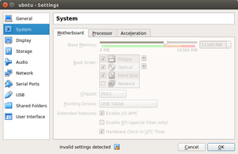
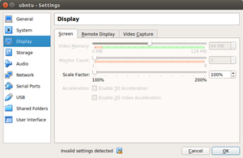
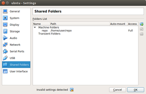
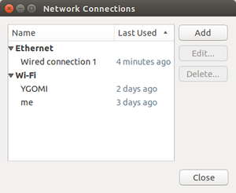
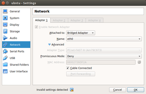

## 参考
* [slum book](https://github.com/gaoxiang12/slambook)
* [virtul box 挂载文件夹](https://blog.csdn.net/a962804835/article/details/72820355)
* [CMake如何查找链接库---find_package的使用方法](https://blog.csdn.net/u011092188/article/details/61425924)
* [CMake实践》笔记二：INSTALL/CMAKE_INSTALL_PREFIX](https://blog.csdn.net/primeprime/article/details/53020147)
* [自己创建XXConfig.cmake文件](https://blog.csdn.net/historycomputer/article/details/59121420)
* [hpp](https://blog.csdn.net/davidhsing/article/details/4222227)
* [ninja](https://www.jianshu.com/p/d118615c1943)
* [欧拉角](https://blog.csdn.net/csxiaoshui/article/details/65437633)
* [eigen](http://eigen.tuxfamily.org/index.php?title-Main_Page)
  >矩阵库
* [pangolin](https://github.com/stevenlovegrove/Pangolin)
  >OpenGL封装库
* [pangolin安装及其使用](https://blog.csdn.net/c602273091/article/details/65441315)
* [C++里面ostream是干什么的](https://zhidao.baidu.com/question/584182022.html?qbl=relate_question_3&word=ostream%26%20operator)
* [Sophus](https://github.com/strasdat/Sophus)
  >李群库
  >```
  > cmake .. -DCMAKE_INSTALL_PREFIX:PATH=$HOME/svslocal
  > sudo make -j4
  > sudo make install
  >```
* [PCL](http://pointclouds.org)
  >Point Cloud Library
* [Ceres](https://github.com/ceres-solver/ceres-solver)
  >通用最小二乘问题求解库
* [g2o](https://github.com/RainerKuemmerle/g2o)
  >通用图优化库
* [opencv](https://opencv.org)
  >[github](https://github.com/opencv/opencv/tree/3.0.0)
  >> 3.1.0 安装报错
* [valgrind](http://www.valgrind.org/)
  >`sudo apt-get install valgrind`  
  >[Linux下性能分析工具和内存泄露检测工具的简介](https://blog.csdn.net/u014717036/article/details/50762252)
  >`valgrind --log-file=./valgrind_report_all --tool=memcheck --leak-check=full --show-leak-kinds=all ./pose_estimation_3d2d 1.png 2.png 1_depth.png 2_depth.png`
* [C++模板](https://www.cnblogs.com/yutongqing/p/6721323.html)
* [C++ Template 基础篇（一）：函数模板](https://blog.csdn.net/lezardfu/article/details/56852043)
* [卡尔曼滤波和维纳滤波](https://blog.csdn.net/sillykog/article/details/78535767)
* [李群、李代数在计算机视觉中的应用](https://blog.csdn.net/x_r_su/article/details/52749616)
* [C++智能指针简单剖析](http://www.cnblogs.com/lanxuezaipiao/p/4132096.html)
* [C++类构造函数初始化列表](http://www.cnblogs.com/BlueTzar/articles/1223169.html)
* [C++笔记——std::min_element和std::max_element](https://blog.csdn.net/breeze5428/article/details/25918925)
* [非修改性序列算法之min_element和max_element](https://blog.csdn.net/maoliran/article/details/52205549)
* [C++11中的匿名函数(lambda函数,lambda表达式)](https://www.cnblogs.com/pzhfei/archive/2013/01/14/lambda_expression.html)
* [C++拷贝构造函数(深拷贝，浅拷贝)](http://www.cnblogs.com/BlueTzar/articles/1223313.html)
* [C++移动构造函数以及move语句简单介绍](https://www.cnblogs.com/qingergege/p/7607089.html)
* [C++类的特殊成员-默认/拷贝/移动构造函数](https://blog.csdn.net/shenwanjiang111/article/details/53576196)
* [C++析构函数后加上virtual的原因](https://blog.csdn.net/u014453898/article/details/60402586)
* [C++强制类型转换操作符 static_cast](http://www.cnblogs.com/QG-whz/p/4509710.html)
* [C++中结构体与类的区别（struct与class的区别](https://www.cnblogs.com/starfire86/p/5367740.html)
* [c++中c_str()用法，越详细越好](https://zhidao.baidu.com/question/104592558.html)
* [C++using声明和using指示](https://blog.csdn.net/mlyjqx/article/details/74783811)
* [图像处理中，outlier和inlier分别指什么](https://blog.csdn.net/daigualu/article/details/73866250)

## 资源
* [vscode下载](https://code.visualstudio.com/Download)
* [meshlab](http://www.meshlab.net/)
  >ubuntu app store里有
* [DBow](https://github.com/rmsalinas/DBow3)
  >DBoW3 is an improved version of the DBow2 library, an open source C++ library for indexing and converting images into a bag-of-word representation
* [BitBucket](http://tech.it168.com/a2017/1026/3176/000003176180.shtml)
  >集成了jira工具

## 虚拟机环境搭建
使用virtual box建立环境
* 
  >要设置大一点
* 
  >如果设置小了，虚拟机屏幕分辨率不够
* 
  >```
  >在宿主机上创建文件夹
  >sudo mkdir /home/usr/repo/
  >
  >#改变宿主机权限
  >sudo chmod -R 777 /home/usr/repo/
  >
  >#虚拟机创建目录
  >sudo mkdir /mnt/xuc
  >
  >#改变目录权限
  >sudo chmod -R 777 /mnt/xuc
  >
  >#挂载宿主机目录到虚拟机目录
  >sudo mount -t vboxsf repo /mnt/xuc
  >
  >#取消挂载
  >sudo umount /mnt/xuc
  >
  >#删除目录
  >sudo rm -rf /mnt/xuc
  >```
* 
  >网卡要先删除，在增加，否则不能上网
* 
## 安装ceres
* 安装依赖包
  >```
  >sudo apt-get install libgflags-dev
  >sudo apt-get install libgoogle-glog-dev
  >```
* 安装本尊
  >```
  >sudo mkdir build
  >cd build
  >sudo cmake ../
  >sudo make
  >make install
  >``` 
## 安装g2o
* 安装依赖包
  >```
  >sudo apt-get install libqglviewer-dev
  >sudo apt-get install libcholmod2.1.2
  >```
* 安装本尊
  >```
  >sudo mkdir build
  >cd build
  >sudo cmake ../
  >sudo make
  >make install
  >``` 