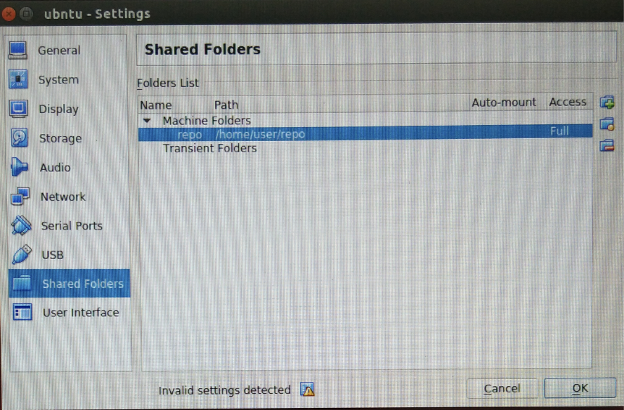

## 参考
* [slum book](https://github.com/gaoxiang12/slambook)
* [virtul box 挂载文件夹](https://blog.csdn.net/a962804835/article/details/72820355)
* [cmake](https://github.com/TheErk/CMake-tutorial)
* [ninja](https://www.jianshu.com/p/d118615c1943)
## action
```
#宿主机改变权限
sudo chmod -R 777 /home/usr/repo/
#虚拟机创建目录
sudo mkdir /mnt/xuc
#改变目录权限
sudo chmod -R 777 /mnt/xuc

#在virtual box里创建shared folders，见图

#挂载宿主机目录到虚拟机目录
sudo mount -t vboxsf repo /mnt/xuc

#取消挂载
sudo umount /mnt/xuc
#删除目录
sudo rm -rf /mnt/xuc
```
* 